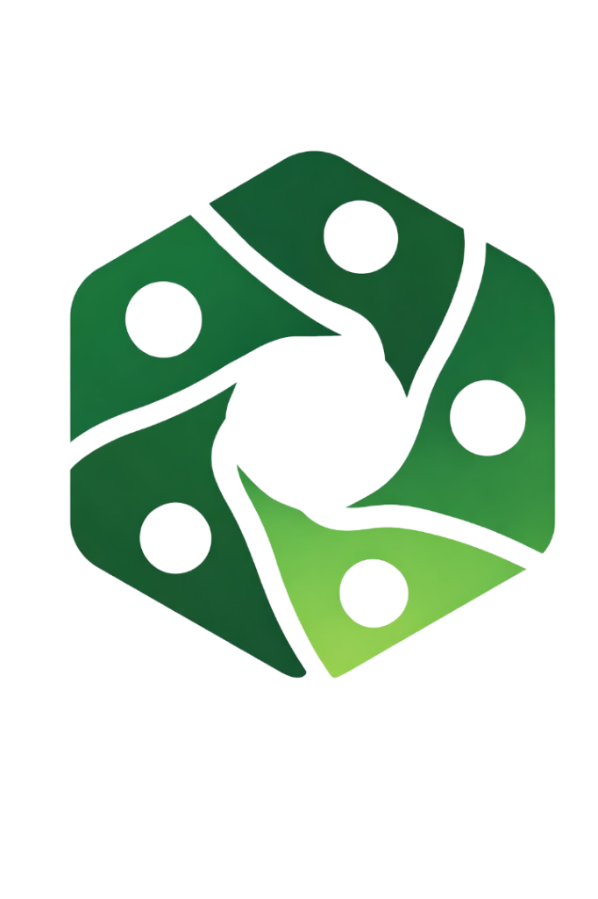

<div align="center">



# Collabicx

**The ultimate collaborative platform for modern hackathons.**

[](https://react.dev/)
[](https://firebase.google.com/)
[](https://nodejs.org/)
[](https://tailwindcss.com/)
[](https://ai.google.dev/)

[Features](#-features) · [Tech Stack](#-tech-stack) · [Getting Started](#-getting-started) · [Architecture](#-architecture) · [Environment Variables](#-environment-variables)

</div>

---

## What is Collabicx?

Collabicx is a full-stack web platform purpose-built for hackathon teams. It brings together everything a team needs in one place — project management, real-time chat, a Kanban board, AI-powered pitch coaching, and a discover marketplace to find teammates — all wrapped in a polished, dark-themed UI.

Whether you're a student looking for teammates at your college or a professional building the next big thing, Collabicx has you covered.

---

## ✨ Features

### 🏆 Team Management
- **Create or join teams** using unique invite codes
- Role-based access control (Team Lead vs. Member)
- Real-time member roster with avatars
- Leave or delete teams with full data cleanup

### 🚀 Hackathon Workspace
- Manage multiple hackathons per team with statuses (Registered, Ongoing, Submitted, Completed)
- Track deadlines, progress percentages, and submission dates
- Persistent "Resume Work" shortcut to your last viewed project

### 📋 Kanban Board
- Drag-and-drop task management across **To Do**, **In Progress**, and **Done** columns
- Assign tasks to specific team members (leads only)
- Category tags (Frontend, Backend, Design, General)
- AI-powered task generation from your project idea using **Gemini 2.5 Flash**

### 🎤 Pitch Practice (AI-Powered)
- Rich text editor with **voice input** support (Web Speech API)
- Context-aware analysis — link your pitch to a specific hackathon project
- Gemini AI evaluates your pitch across four dimensions:
  - Overall Score, Clarity, Confidence, Structure
  - Strengths, Improvements, and General Feedback
- Scores are persisted to Firestore and auto-loaded on return

### 🌍 Discover Marketplace
- Browse open team slots from other builders
- Filter by role (Frontend, Backend, AI, Design, etc.)
- **College-scoped visibility**: show openings only to students from your institution, all colleges, or everyone
- Apply with a GitHub profile + short pitch message
- Real-time application status updates (Pending → Approved/Rejected)

### 🔔 Real-Time Activity Feed
- Socket.IO powered live activity stream per team
- Tracks key events: team creation, joins, messages, task completions, and more

### 🔐 Authentication & Profiles
- Google, GitHub, and Email/Password sign-in via Firebase Auth
- Automated **college verification** via email domain (using the Hipolabs Universities API)
- Custom username selection with real-time availability checking
- Avatar picker with preset options

---

## 🛠 Tech Stack

| Layer | Technology |
|---|---|
| **Frontend** | React 19, Vite, Tailwind CSS v4, Framer Motion, React Router v7 |
| **Backend** | Node.js, Express, Socket.IO |
| **Database** | Firebase Firestore (real-time) |
| **Auth** | Firebase Authentication |
| **Storage** | Firebase Storage |
| **AI** | Google Gemini 2.5 Flash (`@google/generative-ai`) |
| **Real-time** | Socket.IO + Firestore `onSnapshot` listeners |
| **Deployment** | Environment variable driven (compatible with Vercel, Render, Railway) |

---

## 📁 Project Structure

```
collabicx/
├── frontend/                     # Vite + React application
│   ├── src/
│   │   ├── components/           # Reusable UI components
│   │   │   ├── Layout.jsx        # App shell with header
│   │   │   ├── Sidebar.jsx       # Navigation sidebar
│   │   │   ├── PitchModule.jsx   # AI pitch editor & feedback UI
│   │   │   ├── HackathonCard.jsx # Project card component
│   │   │   ├── ActivityPanel.jsx # Real-time activity feed
│   │   │   └── ...
│   │   ├── pages/                # Route-level page components
│   │   │   ├── LandingPage.jsx
│   │   │   ├── Login.jsx
│   │   │   ├── ProfileSetup.jsx
│   │   │   ├── Dashboard.jsx     # Main team dashboard
│   │   │   ├── TeamsDashboard.jsx
│   │   │   ├── HackathonWorkspace.jsx
│   │   │   ├── KanbanBoard.jsx
│   │   │   ├── Discover.jsx
│   │   │   └── PitchPractice.jsx
│   │   ├── firebase/
│   │   │   ├── config.js         # Firebase SDK initialization
│   │   │   └── functions.js      # All Firestore operations
│   │   ├── services/
│   │   │   └── gemini.js         # Client-side Gemini task generation
│   │   ├── context/
│   │   │   └── ThemeContext.jsx  # Dark/light mode
│   │   └── constants/
│   │       └── avatars.js        # Preset avatar definitions
│   └── package.json
│
└── backend/                      # Express + Socket.IO server
    ├── server.js                 # Entry point, socket setup
    ├── firebase.js               # Firebase Admin SDK init
    ├── routes/
    │   ├── auth.js               # Profile verification + college detection
    │   ├── pitch.js              # Pitch analysis endpoints
    │   ├── teamOpenings.js       # Team opening CRUD with visibility rules
    │   └── activity.js           # Activity feed REST endpoint
    ├── services/
    │   └── pitchAnalysisService.js  # Gemini pitch analysis logic
    ├── models/
    │   └── Activity.js           # Activity data model reference
    └── package.json
```

---

## 🚀 Getting Started

### Prerequisites

- Node.js 18+
- A Firebase project with Firestore, Authentication, and Storage enabled
- A Google Gemini API key
- Firebase service account key (for the backend)

### 1. Clone the repository

```bash
git clone https://github.com/your-username/collabicx.git
cd collabicx
```

### 2. Set up the Backend

```bash
cd backend
npm install
```

Place your Firebase service account key at `backend/serviceAccountKey.json`.

Create a `.env` file in the `backend/` directory:

```env
PORT=4000
GEMINI_API_KEY=your_gemini_api_key_here
```

Start the backend server:

```bash
# Development (with hot reload)
npm run dev

# Production
npm start
```

The backend will be available at `http://localhost:4000`.

### 3. Set up the Frontend

```bash
cd frontend
npm install
```

Create a `.env` file in the `frontend/` directory (see [Environment Variables](#-environment-variables) below).

Start the development server:

```bash
npm run dev
```

The app will be available at `http://localhost:5173`.

---

## 🔑 Environment Variables

### Frontend (`frontend/.env`)

```env
# Firebase Config
VITE_apiKey=your_firebase_api_key
VITE_authDomain=your_project.firebaseapp.com
VITE_projectId=your_project_id
VITE_storageBucket=your_project.appspot.com
VITE_messagingSenderId=your_messaging_sender_id
VITE_appId=your_app_id

# Gemini AI (for client-side task generation)
VITE_GEMINI_API_KEY=your_gemini_api_key

# Backend URL
VITE_BACKEND_URL=http://localhost:4000
```

### Backend (`backend/.env`)

```env
PORT=4000
GEMINI_API_KEY=your_gemini_api_key
```

---

## 🏗 Architecture

### Data Flow

```
User Browser (React)
    │
    ├── Firestore onSnapshot  ──► Real-time updates (tasks, messages, activities)
    │
    └── REST / Socket.IO  ──────► Express Backend (port 4000)
                                      │
                                      ├── Firebase Admin SDK  ──► Firestore
                                      │
                                      └── Gemini AI API  ──────► Pitch Analysis
```

### Key Design Decisions

**Firestore as the primary real-time layer** — Tasks, messages, notes, and activity logs all use `onSnapshot` listeners directly from the frontend, minimizing backend load for read-heavy operations.

**Backend handles auth-sensitive operations** — Role verification, college domain detection, and pitch analysis run server-side via Firebase Admin to prevent spoofing.

**College-scoped visibility** — Team openings support three visibility levels: `my-college` (verified domain match), `all-colleges` (any student), and `public` (everyone). The backend enforces these rules at query time.

**Chunked Firestore queries** — Firestore's `in` operator is limited to 10 items. All multi-team queries (activities, openings, applications) are automatically chunked and merged client-side.

---

## 🗄 Database Schema (Firestore)

```
users/{userId}
  ├── name, email, username, avatar
  ├── role, profession, bio
  └── verifiedStudent, college, collegeDomain

teams/{teamId}
  ├── name, description, joinCode, createdBy
  └── members/{memberId}         # subcollection
      └── userId, role, joinedAt

teams/{teamId}/hackathons/{hackathonId}
  ├── name, description, theme, status
  ├── startDate, endDate, registrationDeadline, submissionDeadline
  ├── tasks/{taskId}             # Kanban tasks
  ├── messages/{messageId}       # Team chat
  ├── notes/shared               # Collaborative notes
  └── links/{linkId}             # Submission links & assets

teamOpenings/{openingId}
  ├── teamId, teamName, createdBy
  ├── description, requiredRoles
  ├── visibility, collegeDomain
  └── slotsOpen, status

teamApplications/{applicationId}
  ├── teamOpeningId, teamId, applicantId
  ├── githubUrl, message, status
  └── createdAt, reviewedAt

activities/{activityId}
  ├── teamId, userId, type
  └── metadata, createdAt

user_pitches/{userId_targetId}
  ├── pitchContent, overallScore
  ├── clarityScore, confidenceScore, structureScore
  ├── strengths[], improvements[]
  └── feedback, best_part, worse_part
```

---

## 🤖 AI Features

### Task Generation (Client-side)
Located in `frontend/src/services/gemini.js`. Given a project idea string, Gemini generates a structured JSON array of sprint tasks with titles and categories. Called directly from the Hackathon Workspace.

### Pitch Analysis (Server-side)
Located in `backend/services/pitchAnalysisService.js`. The backend sends the pitch content (and optionally a project idea for context) to Gemini 2.5 Flash. The model returns a structured JSON score report which is saved to Firestore and returned to the client.

Toggle mock mode for development (no API quota consumed):
```js
// backend/services/pitchAnalysisService.js
const USE_MOCK_GEMINI = true; // Set to false for real analysis
```

---

## 🎨 Theming

Collabicx supports dark and light modes powered by Tailwind CSS and a React context (`ThemeContext`). The default is dark mode. Toggle is available in the Teams Dashboard header.

Custom CSS variables in `frontend/src/index.css`:
```css
--color-primary: #10b981        /* Emerald green */
--color-background-light: #D7EEAE
--color-background-dark: #072724
```

---

## 📜 Scripts

| Location | Command | Description |
|---|---|---|
| `frontend/` | `npm run dev` | Start Vite dev server |
| `frontend/` | `npm run build` | Production build |
| `frontend/` | `npm run lint` | ESLint check |
| `backend/` | `npm run dev` | Start with nodemon (hot reload) |
| `backend/` | `npm start` | Start production server |

---

## 🤝 Contributing

1. Fork the repository
2. Create a feature branch: `git checkout -b feature/amazing-feature`
3. Commit your changes: `git commit -m 'Add amazing feature'`
4. Push to the branch: `git push origin feature/amazing-feature`
5. Open a Pull Request

---

## 📄 License

This project is licensed under the MIT License.

---

<div align="center">
  <sub>Built with ❤️ for hackathon builders everywhere.</sub>
</div>
